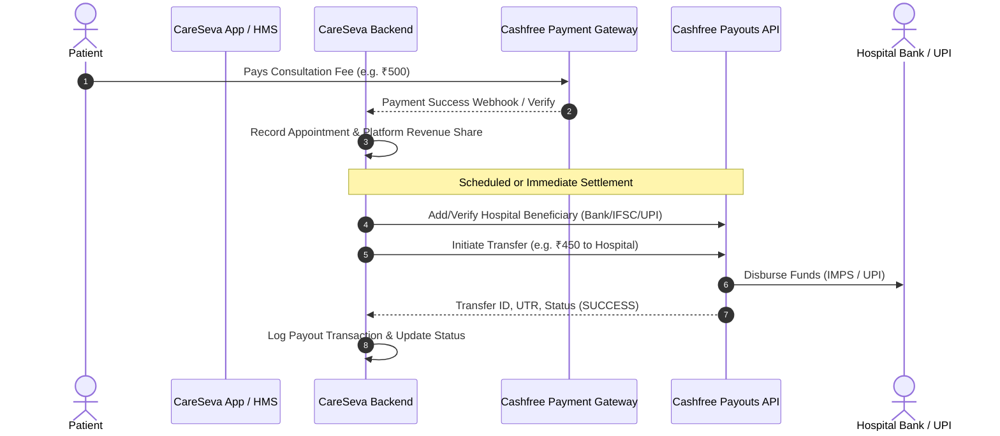

# Implementation Plan - Cashfree Payouts API Integration in CareSeva Backend

Integrate **Cashfree Payouts API** into `careseva_backend` to enable automated, instant, and scheduled disbursements from CareSeva's merchant account to hospitals and healthcare facilities.

## Overview & Architecture

When patients pay online via Cashfree Payment Gateway, the collected fees settle in CareSeva's primary bank/payout account. Cashfree Payouts API will allow CareSeva to:
1. Register and verify Hospital / Facility bank accounts and UPI IDs as **Beneficiaries** in Cashfree.
2. Disburse hospital consultation/service shares automatically or on-demand to the hospital's registered bank/UPI.
3. Track payout settlements, UTR numbers, transfer statuses (`SUCCESS`, `PENDING`, `FAILED`), and available payout wallet balance.
4. Process real-time payout webhooks from Cashfree.

---

## User Review Required

> [!IMPORTANT]
> **Cashfree Payouts Credentials:**
> Cashfree Payouts requires Payouts API Client ID & Client Secret (and optionally Payouts Public Key if 2FA is active). We will add config parameters: `CASHFREE_PAYOUT_CLIENT_ID`, `CASHFREE_PAYOUT_CLIENT_SECRET`, and `CASHFREE_PAYOUT_ENV` into `.env` and `core/config.py`. If specific payout credentials are not provided initially, the system will fall back to using existing `CASHFREE_APP_ID` / `CASHFREE_SECRET_KEY` and graceful sandbox simulation mode.

---

## Proposed Changes

### Core & Configuration

#### [MODIFY] [config.py](file:///c:/Users/me/OneDrive/Desktop/CareSeva/careseva_backend/core/config.py)
- Add Payouts configuration fields:
  - `CASHFREE_PAYOUT_CLIENT_ID: Optional[str]`
  - `CASHFREE_PAYOUT_CLIENT_SECRET: Optional[str]`
  - `CASHFREE_PAYOUT_ENV: str = "production"`
  - `CASHFREE_PAYOUT_STAGE: str = "PROD"` (or "TEST")

#### [NEW] [cashfree_payouts_service.py](file:///c:/Users/me/OneDrive/Desktop/CareSeva/careseva_backend/core/cashfree_payouts.py)
- Implement `CashfreePayoutsService`:
  - Token generation & caching (`/payout/v1/authorize`)
  - Add Beneficiary (`/payout/v1/addBeneficiary` / `v1.2/beneficiary`)
  - Get Beneficiary (`/payout/v1/getBeneficiary/{beneId}`)
  - Direct Payout / Transfer (`/payout/v1/requestTransfer` / `requestAsyncTransfer`)
  - Get Transfer Status (`/payout/v1/getTransferStatus?transferId=...`)
  - Get Payout Wallet Balance (`/payout/v1/getBalance`)
  - Built-in error handling and sandbox simulation fallback.

---

### Database Models

#### [MODIFY] [hospital.py](file:///c:/Users/me/OneDrive/Desktop/CareSeva/careseva_backend/models/hospital.py)
- Add Bank & Payout Information fields to `HospitalBase`, `HospitalUpdate`, and `HospitalInDB`:
  - `bank_account_number: Optional[str]`
  - `bank_ifsc: Optional[str]`
  - `bank_account_holder: Optional[str]`
  - `bank_name: Optional[str]`
  - `upi_id: Optional[str]`
  - `payout_beneficiary_id: Optional[str]`
  - `payout_beneficiary_status: Optional[str]` (e.g., `UNREGISTERED`, `VERIFIED`, `REJECTED`)
  - `payout_preferred_mode: Optional[str]` (`banktransfer` or `upi`)

#### [NEW] [payout.py](file:///c:/Users/me/OneDrive/Desktop/CareSeva/careseva_backend/models/payout.py)
- Model schema for payout transactions:
  - `transfer_id`: Unique Payout ID (e.g. `CS_PAYOUT_...`)
  - `hospital_id`: ID of the recipient facility
  - `hospital_name`: Name of the hospital
  - `amount`: Net transfer amount
  - `currency`: INR
  - `transfer_mode`: `banktransfer` or `upi`
  - `transfer_status`: `SUCCESS`, `PENDING`, `FAILED`, `REVERSED`
  - `utr`: Bank UTR reference number
  - `appointment_ids`: List of appointments settled in this payout (if batch)
  - `remarks`: Note/memo
  - `created_at` and `updated_at`

---

### API Routes

#### [NEW] [payouts.py](file:///c:/Users/me/OneDrive/Desktop/CareSeva/careseva_backend/routes/payouts.py)
- **Hospital Payout Management Endpoints**:
  - `POST /api/payouts/hospital/{hospital_id}/bank-details`: Save/update hospital bank & UPI details.
  - `POST /api/payouts/hospital/{hospital_id}/sync-beneficiary`: Register hospital on Cashfree Payouts.
  - `GET /api/payouts/hospital/{hospital_id}/settlements`: List settlement history for a specific hospital.
  - `GET /api/payouts/hospital/{hospital_id}/unsettled-balance`: Get total unsettled patient payments ready for payout.
- **Admin & Disbursement Endpoints**:
  - `POST /api/payouts/disburse`: Trigger instant or batch payout to a hospital.
  - `GET /api/payouts/transfer-status/{transfer_id}`: Query live transfer status & UTR from Cashfree.
  - `GET /api/payouts/wallet-balance`: Fetch live Cashfree Payouts balance.
  - `GET /api/payouts/transactions`: List all payout transactions across all hospitals with filters.
  - `POST /api/payouts/webhook`: Cashfree Payout transfer notification webhook handler.

#### [MODIFY] [main.py](file:///c:/Users/me/OneDrive/Desktop/CareSeva/careseva_backend/main.py)
- Register `payouts.router` with prefix `/api/payouts`.

---

## Verification Plan

### Automated / API Verification
1. Test Beneficiary sync endpoint with mock and live Cashfree Payouts API.
2. Test initiating a payout transfer, checking transfer status, and updating appointment settlement status in MongoDB.
3. Test getting wallet balance and hospital settlement history.
4. Verify webhook payload processing.

### Manual Verification
- Test through FastAPI Swagger UI (`/docs`) or curl:
  1. Add bank details for a test hospital.
  2. Sync beneficiary with Cashfree.
  3. Query unsettled balance.
  4. Initiate transfer and verify database record and Cashfree response.
